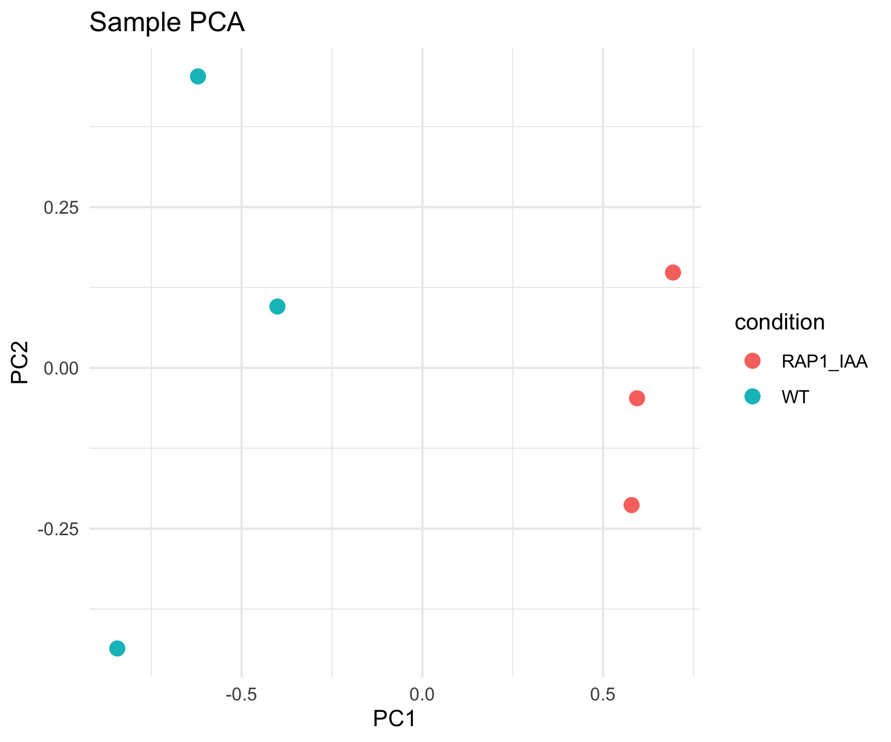

# Omics Workstation

A bioinformatics portfolio built on **real published RNA-seq data**, not toy
examples — automation & reproducible workflows, statistical modeling, and
data manipulation, demonstrated end to end.

**The core result:** the same real yeast RNA-seq experiment (GSE110004,
wild-type vs Rap1 transcription-factor depletion) analyzed by two
independent workflow managers, producing identical differential expression
calls — cross-verified, not just individually run:

## What's here

- **[pipelines/rnaseq-snakemake/](pipelines/rnaseq-snakemake/)** — bulk
  RNA-seq pipeline (FastQC → fastp → Salmon → MultiQC → DESeq2) in
  Snakemake, runs via conda or (documented) Apptainer containers
- **[pipelines/rnaseq-nextflow/](pipelines/rnaseq-nextflow/)** — the same
  pipeline reimplemented in Nextflow (DSL2), runs via conda or Docker
  (verified both ways) — same real data, matching results
- **[stats/rnaseq-stats-notebook/](stats/rnaseq-stats-notebook/)** —
  statistical modeling built from scratch on the pipeline's real DESeq2
  output: hypothesis testing, the negative binomial GLM DESeq2 actually
  fits, multiple testing correction, PCA/clustering — every method
  implemented independently and validated against DESeq2's own numbers
- **[pipelines/scrnaseq-nextflow/](pipelines/scrnaseq-nextflow/)** —
  single-cell pipeline: STARsolo quantification (with a real, diagnosed
  macOS STAR bug) plus a real perturbation-screen case study — a public
  drug-dose-response dataset (Srivatsan et al. 2020, 24k cells, 4 drugs),
  QC → clustering → differential expression → dose-response analysis,
  including a genuine cytotoxicity-driven confound found and explained,
  not smoothed over
- **[pipelines/scrnaseq-snakemake/](pipelines/scrnaseq-snakemake/)** — the
  perturbation-screen analysis above, reimplemented in Snakemake — same
  cross-verification approach as the bulk pipelines, confirmed to produce
  **exactly matching** results (cell/gene/cluster counts, per-drug DE hit
  counts) against the Nextflow version
- **The bulk RNA-seq pipelines have real CI** (badges above) — every push
  re-downloads the real test data and re-runs the full pipeline on GitHub's
  own runners, not just a lint check

## Quick start

Each component is self-contained with its own setup/run instructions in its
own README — start with whichever's relevant:
[rnaseq-snakemake](pipelines/rnaseq-snakemake/README.md) ·
[rnaseq-nextflow](pipelines/rnaseq-nextflow/README.md) ·
[stats notebook](stats/rnaseq-stats-notebook/README.md) ·
[scrnaseq-nextflow](pipelines/scrnaseq-nextflow/README.md) ·
[scrnaseq-snakemake](pipelines/scrnaseq-snakemake/README.md)

## Why two workflow managers for the same pipeline

Not redundancy — a deliberate comparison, applied twice now (bulk RNA-seq,
then the perturbation-screen analysis). Building the identical analysis
twice, in Snakemake and Nextflow, and getting matching results is a
stronger reproducibility claim than either alone: it shows the result is a
property of the *analysis*, not an artifact of one specific tool's
behavior. The bulk pipelines surfaced a genuine, documented reproducibility
finding along the way — conda vs Docker builds of the same tool version
can differ at the platform level (macOS vs Linux binaries), shifting
borderline-significant results slightly (see the
[Nextflow pipeline's README](pipelines/rnaseq-nextflow/README.md#a-reproducibility-caveat-worth-knowing)).
The perturbation-screen pair (scrnaseq-nextflow/scrnaseq-snakemake) ran
cleaner — both conda-only, both landing on an exact match — which is itself
worth noting: the earlier caveat was specifically about conda vs *Docker*
platform differences, not a general reproducibility weakness, and this
second pair (no Docker involved) is the control case that confirms that.

## Roadmap & background

This repo is the working record of a structured skills transition
(wet-lab → bioinformatics analyst), built in public with real debugging
included, not hidden. **[ROADMAP.md](ROADMAP.md)** is the staged plan with
progress tracked; **[resources.md](resources.md)** is the curated
reading list behind it.
