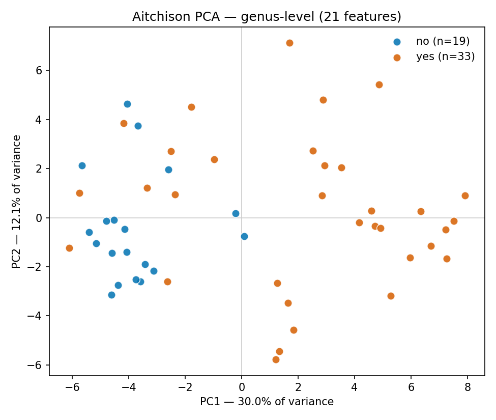

# amplicon-nextflow

[](https://github.com/Bello-Bello/omics-workstation/actions/workflows/amplicon-nextflow-ci.yml)

16S amplicon pipeline: raw multiplexed reads → ASVs → taxonomy →
compositional statistics, run end to end on public soil data.

The dataset is the Atacama Desert soil survey (Neilson et al. 2017,
*mSystems*): 75 samples of hyper-arid soil, split between vegetated and barren
sites along two transects. The question is whether vegetation changes the soil
bacterial community, and which taxa carry the difference.

**Result.** Vegetation explains 15.2% of community variation (PERMANOVA
pseudo-F 8.93, p = 0.001, 999 permutations). The differentially abundant taxa
are the ones you would predict: *Bradyrhizobium* (nitrogen-fixing plant
symbiont), *Candidatus* Nitrososphaera (ammonia-oxidising archaeon) and DA101
enriched in vegetated soil, and the desiccation-resistant *Rubrobacter*
enriched in barren soil. Two independent full executions produced
byte-identical figures and summary statistics.



## Architecture

```
FETCH ─┬─> IMPORT_EMP ─> DEMUX ─> DENOISE_DADA2 ─┬─> CLASSIFY ─┐
       │                                         │             ├─> EXPORT ─> COMPOSITIONAL_ANALYSIS
       └─> FETCH_CLASSIFIER ─────────────────────┘─────────────┘
       └──────────── QIIME2 container ──────────────┘   └── conda env ──┘
```

The workflow splits at `EXPORT_TABLE`. Upstream is QIIME2 in a pinned
container, handling EMP-protocol demultiplexing, DADA2 denoising and
naive-Bayes classification. Downstream is a small conda environment running
the statistics, with the compositional methods in
[`compositional/`](compositional/).

Splitting there keeps the analysis independent of QIIME2's release cadence and
its type system. The downstream half consumes a plain TSV, so it would work
unchanged against a table from any other platform.

## Why the statistics are implemented, not called

QIIME2 ships `qiime composition ancombc`, and a one-line call to it would have
been shorter.

Writing CLR, PERMANOVA and Benjamini-Hochberg directly buys three things.
Assumptions become explicit and auditable instead of sitting in plugin
defaults. The zero-replacement, filtering and permutation steps are each
parameterised and recorded in `summary.json`, so any result traces back to the
exact subcomposition it describes. And the differential abundance test can
report a point estimate and a depth-aware p-value side by side, which a single
plugin call does not expose.

The cost of writing them yourself is correctness risk, so
[`bin/validate_compositional.py`](bin/validate_compositional.py) gates the run
instead of trailing it: 19 checks covering mathematical invariants, agreement
with reference implementations, and recovery of planted signal against a null
dataset. PERMANOVA matches scikit-bio's pseudo-F to machine precision.
Benjamini-Hochberg matches statsmodels to 2.2e-16. CI runs the validation
before the pipeline, so bad maths fails in one minute instead of fifteen.

## ASV and genus level, both reported

The analysis runs twice: once on the ASV table, once on the rank-collapsed
table.

ASVs are exact sequences, so two ASVs one base apart stay separate features
even when they are the same organism for practical purposes. That splits
signal across columns and costs power. Collapsing to genus pools them, at the
cost of resolution. Neither level is correct in general, and where they
disagree that is a measure of robustness, not a contradiction.

This dataset disagrees usefully. Unsupervised clustering fails to recover the
study design at ASV level (adjusted Rand −0.05) and recovers it at genus level
(0.47).

The collapse keeps unclassified features in an explicit `Unassigned_genus`
bin. In Atacama soil that bin is large, since much of the community has no
cultured representative in Greengenes, and dropping it would silently change
every ratio in the table.

## Compositional treatment

A 16S table measures ratios, not abundances. Sequencing returns a fixed number
of reads per sample, so counts only carry information about relative
composition within a sample. Two consequences drive the design. The
constant-sum constraint induces negative correlations between taxa that have
no biological relationship. And Euclidean distance on proportions treats a
1% → 2% change, which is a doubling, as equivalent to 50% → 51%, which is a 2%
shift.

The centered log-ratio transform divides each part by its own sample's
geometric mean before taking logs. That cancels the sequencing total by
construction and returns the data to real space, where PCA, hierarchical
clustering and location tests are valid. Distances are therefore Aitchison
distances, which are subcompositionally coherent: filtering rare taxa does not
move the ordination of the samples that remain.

Differential abundance is reported twice. Once on the point-estimate CLR, and
once as a Monte-Carlo average over Dirichlet draws from each sample's count
posterior, which propagates sequencing-depth uncertainty into the p-value. The
depth-aware result is the more conservative of the two, 10 significant ASVs
against 23, and both are published.

## Structure

```
main.nf                          # the workflow
nextflow.config                  # params, container/conda wiring, test profile
modules/
  fetch_data.nf                    # data + pretrained classifier, storeDir-cached
  import_and_demux.nf              # EMPPairedEndSequences -> per-sample reads
  denoise.nf                       # DADA2 -> ASV table + rep seqs + stats
  classify.nf                      # naive-Bayes taxonomy
  export_table.nf                  # BIOM/TSV export, out of the .qza type system
  compositional_analysis.nf        # the statistics
compositional/                   # reusable package, not dataset-specific
  transforms.py                    # closure, zero replacement, CLR, Aitchison distance
  stats.py                         # PERMANOVA, differential abundance, BH
  ordination.py                    # PCA on CLR, hierarchical clustering, ARI
  plots.py                         # scatter / bar / box / heatmap / dendrogram
  io.py                            # QIIME2 exports -> aligned frames
bin/
  run_compositional_analysis.py    # the driver Nextflow calls
  validate_compositional.py        # cross-checks vs scikit-bio & statsmodels
envs/compositional.yaml          # the analysis env (not QIIME2)
```

## Running it

Requires Docker, conda and Nextflow.

```bash
nextflow run main.nf                  # full run, ~1.35M reads, 10-15 min
nextflow run main.nf -profile test    # same data, fewer permutations
python bin/validate_compositional.py  # statistics self-check, no data needed
```

Results land in `results/`:

| Path | Contents |
|---|---|
| `qiime/` | `.qza`/`.qzv` artifacts, viewable at [view.qiime2.org](https://view.qiime2.org) |
| `qiime/denoising-stats.tsv` | read attrition through filter → merge → chimera removal |
| `exported/` | plain-TSV feature table and taxonomy |
| `compositional/report.md` | generated interpretation, with stated limitations |
| `compositional/summary.json` | every number quoted in the report |
| `compositional/*_differential_abundance.csv` | per-taxon results, ASV and genus |
| `compositional/*.png` | ordination, dendrogram+heatmap, volcano, box plots, depth |

## Parameters

| Param | Default | Effect |
|---|---|---|
| `trunc_len_f` / `trunc_len_r` | 150 / 150 | Quality truncation. The two must leave enough overlap to merge pairs. Too aggressive and the merge step returns almost nothing without erroring. |
| `trim_left_f` / `trim_left_r` | 13 / 13 | Primer removal. |
| `min_depth` | 1000 | Minimum per-sample reads. Below this, zero imputation dominates the composition and you are no longer measuring anything. |
| `min_prevalence` / `min_total_count` | 0.15 / 25 | Rare-feature filter. Keeping near-empty columns lets the zero replacement drive the geometric mean. |
| `group_column` / `group_a` / `group_b` | `vegetation` / `yes` / `no` | Any two-level metadata column. `transect-name` is the other natural contrast here. |
| `monte_carlo` | 128 | Dirichlet draws for the depth-aware p-value. |

## Stated limitations

The generated report carries these explicitly:

- **PERMANOVA responds to dispersion as well as location.** A significant
  result establishes that the groups differ, not that they are centered
  differently.
- **Results describe the filtered subcomposition.** Aitchison geometry makes
  this valid, not free. The thresholds are recorded alongside the results.
- **CLR values are relative.** "Enriched in vegetated soil" means enriched
  against the rest of that community. Absolute cells per gram needs spike-ins
  or qPCR.
- **One classifier, one region.** Greengenes 13_8 trained on 515F/806R matches
  this dataset's primers. Substitute a reference trained on a different region
  and you get confident misassignment, not an error.

## A defect in the standard zero replacement

The conventional multiplicative replacement assigns each zero `0.65 / depth`
of the composition. That constant is derived for samples with adequate depth,
and without it the method fails silently. Imputed mass is
`n_zeros × delta`, which on the 1%-subsampled table reached **1.625** for a
composition that has to sum to 1. Re-closure then assigns the observed parts a
negative proportion, and the failure finally surfaces in `clr()`, two
functions downstream of where it started.

The fix caps total imputed mass per sample and warns when a row hits the cap.
A row that hits it is more than half imputation, and the right response there
is to raise `min_depth`, not to trust the transformed values. Regression test:
"Shallow sample does not produce negative parts" in
`bin/validate_compositional.py`.

This is also why the `test` profile cuts permutations instead of dropping to
the 1% subsample. At roughly 230 reads per sample that table is 82% zeros
after filtering, so CI would pass without exercising anything real.

## CI

Two jobs. The statistics validation runs first and gates the second. The
pipeline job then runs the full workflow on the real data and asserts the
biological result, not just exit codes: it fails if fewer than 30 samples or
10 features survive filtering, or if the vegetation effect stops being
detectable. A wrong demultiplexing flag or an over-aggressive truncation
length produces valid-looking empty output instead of an error, so the
assertions target that failure mode specifically.

## Data

- **Reads and metadata** — Atacama soil microbiome, via QIIME2's public data
  mirror. Not committed; fetched at run time and cached in `.data_cache/`.
  Neilson, J.W. *et al.* (2017) "Significant impacts of increasing aridity on
  the arid soil microbiome", *mSystems* 2:e00195-16.
- **Classifier** — Greengenes 13_8, 99% OTUs, 515F/806R region, pretrained for
  scikit-learn 1.4.2 to match the pinned container.
